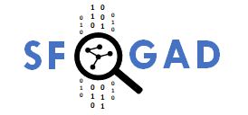
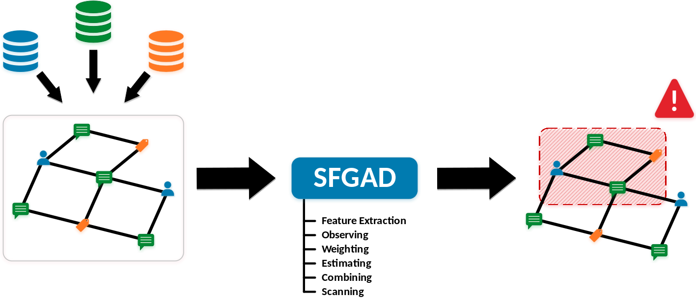

---

SFGAD is a tool for detecting anomalies in **graph** and **graph streams** with python.

I provides:

* Efficient computation of graph **features**
* Statistical models for detecting **anomalous behavior**
* Graph scanning to detect **connected graph anomalies**
* A customizable detection framework with **6** components
* Several pre-defined **configurations**

